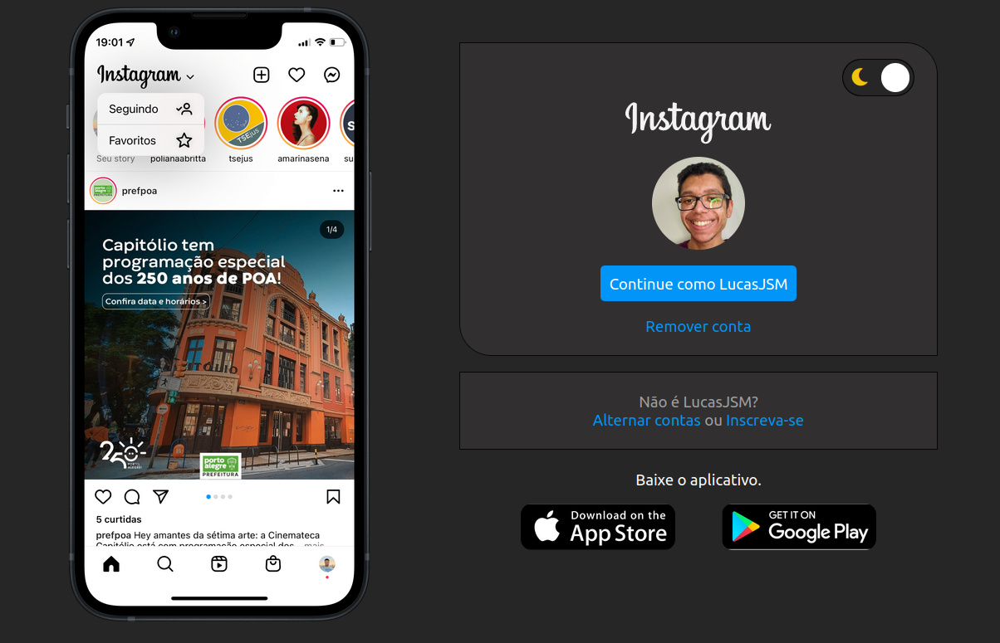

# Recriando a página inicial do Instagram

Projeto realizado no bootcamp Impulso JavaScript Evolution com base no diretório da expert: [SpruceGabriela](https://github.com/SpruceGabriela/instagram-dio).

## Página em modo claro nas versões normal e mobile

## Página em modo escuro nas versões normal e mobile

